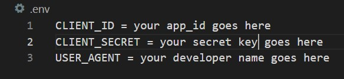

# Beautiful Music Data and Spotify Playlist

I am attempting to use various Python APIs and libraries to create a script to parse through the comments of a Reddit post to create data. 
The comments are song suggestions so I will create Spotify playlists once I write a script to parse through the data. 

## Documentation

To recreate the script, you will need to create your own .env file with your own credentials when creating a 
[Reddit app](https://medium.com/geekculture/utilizing-reddits-api-8d9f6933e192) 

Hiding the credentials in Python with [Python-Decouple](https://pypi.org/project/python-decouple/)

Creating data from Reddit with [PRAW: The Python Reddit API Wrapper](https://praw.readthedocs.io/en/stable/getting_started/quick_start.html)

Manipulating and analysing the data with [pandas](https://pandas.pydata.org/docs/getting_started/index.html#getting-started)

## License

[GNU GPL-3.0](https://choosealicense.com/licenses/gpl-3.0/)

